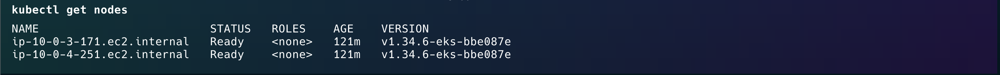
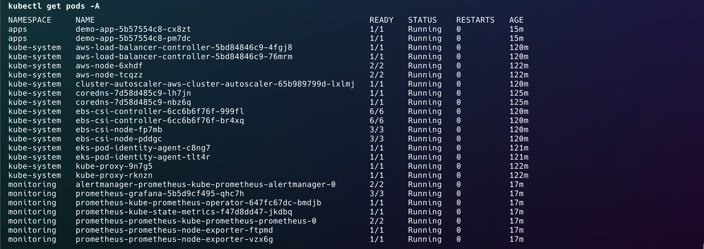
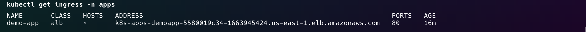
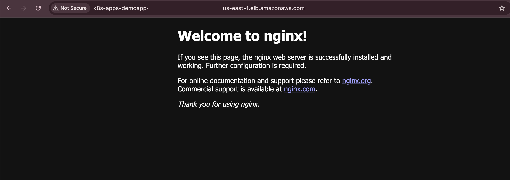
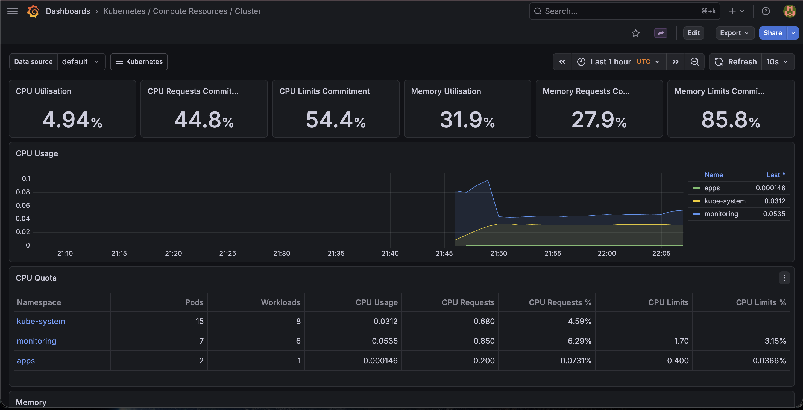
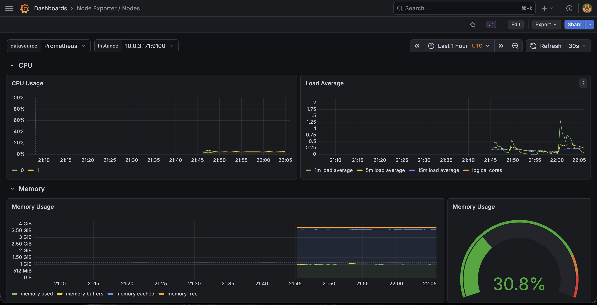
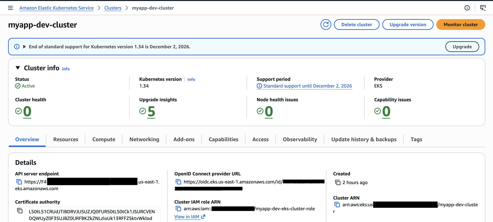

# AWS EKS-First Infrastructure with Terraform

Infrastructure as Code on AWS using Terraform modules for an EKS-first application platform.

## Architecture

```text
Internet
  ↓
Application Load Balancer (created by AWS Load Balancer Controller)
  ↓
Ingress on EKS
  ↓
Kubernetes Service
  ↓
Application Pods on EKS managed node groups
  ↓
RDS PostgreSQL

Prometheus + Grafana + Alertmanager run on EKS for cluster monitoring.
```

## What this project provisions

- VPC with public and private subnets across two Availability Zones
- Internet Gateway and one NAT Gateway per Availability Zone
- EKS cluster with managed node group
- IAM roles for EKS, AWS Load Balancer Controller, and EBS CSI driver via EKS Pod Identity
- RDS PostgreSQL in private subnets
- Explicit runtime security group rules between ALB, EKS, and RDS
- AWS Load Balancer Controller installed with Helm
- Cluster Autoscaler installed with Helm and integrated through EKS Pod Identity
- EKS Pod Identity Agent add-on, EBS CSI add-on, and default gp3 storage class
- kube-prometheus-stack for monitoring on EKS, pinned for controlled upgrades
- A demo application exposed through ALB-backed Kubernetes Ingress

## EKS-first design

This project no longer uses a standalone EC2 Auto Scaling Group or a separately managed Terraform ALB module.

The primary runtime is Amazon EKS:

- Application workloads run on EKS managed node groups
- Ingress is handled by AWS Load Balancer Controller
- ALBs are created from Kubernetes Ingress resources
- Monitoring runs on the EKS cluster

## Security and secret handling

- ALB and RDS use Terraform-managed security groups, while runtime access to EKS uses the primary cluster security group created by Amazon EKS
- Grafana is exposed as `ClusterIP`, not a public load balancer
- Grafana admin password is no longer hardcoded in versioned values files
- Slack webhook routing is optional and disabled by default until you provide a webhook URL
- RDS master password is no longer required at plan time unless you want to override the generated value

## Project structure

```text
├── main.tf
├── providers.tf
├── variables.tf
├── outputs.tf
├── secrets.tf
├── sg-rules.tf
├── monitoring.tf
├── addons.tf
├── lbc.tf
├── autoscaler.tf
├── backend.tf
├── versions.tf
├── terraform.tfvars.example
│
├── modules/
│   ├── vpc/
│   ├── security-groups/
│   ├── iam/
│   ├── eks/
│   ├── rds/
│   └── addons-pod-identity/
│
├── helm/
│   ├── prometheus/
│   ├── grafana/
│   └── alertmanager/
│
├── scripts/
│   └── deploy-app.sh            # Automated app deployment with ALB SG injection
│
└── k8s/                          # Application manifests (deployed separately)
    ├── namespace.yaml
    ├── deployment.yaml
    ├── service.yaml
    └── ingress.yaml
```

## Prerequisites

- Terraform >= 1.7.0
- AWS CLI configured with credentials
- kubectl
- Helm
- An existing S3 bucket for Terraform remote state

## Quick start

```bash
cp terraform.tfvars.example terraform.tfvars
# edit terraform.tfvars and set eks_public_access_cidrs to your current public IP/CIDR
terraform init

# create and switch to the dev workspace
terraform workspace new dev
terraform plan
terraform apply

# configure kubectl
aws eks update-kubeconfig --region us-east-1 --name $(terraform output -raw eks_cluster_name)

# deploy the demo application
./scripts/deploy-app.sh
```

The active workspace name (`dev`, `prod`, etc.) is used automatically as the environment name in all resource names and tags. Each workspace gets its own isolated state file in S3 under `env:/<workspace>/`.

## Access

After deploying the application, get the ALB hostname:

```bash
kubectl get ingress -n apps
```

To access Grafana locally:

```bash
kubectl port-forward svc/prometheus-grafana 3000:80 -n monitoring
```

To print generated sensitive values when needed:

```bash
terraform output -raw grafana_admin_password
terraform output -raw rds_master_password
```

## Deployment Validation

This infrastructure was successfully deployed and validated on AWS.  
The environment was destroyed after validation to avoid ongoing AWS costs.

### 1. EKS worker nodes are ready


### 2. Platform components are running


### 3. Ingress provisioned an ALB address


### 4. Demo application exposed through ALB


### 5. Cluster-level monitoring in Grafana


### 6. Node-level metrics with Node Exporter


### 7. EKS cluster active in AWS Console


## Notes

- The default EKS version is set to `1.34`
- The EKS public API endpoint is intentionally restricted through `eks_public_access_cidrs`; set this to your own public IP range before applying
- EKS control plane logs are pre-created in CloudWatch Logs with configurable retention via `eks_control_plane_log_retention_in_days`
- The VPC now creates one NAT Gateway per Availability Zone for better private-subnet egress resilience
- Prometheus and Grafana use persistent volumes backed by EBS CSI
- The kube-prometheus-stack chart is pinned with `kube_prometheus_stack_chart_version` for controlled upgrades
- RDS remains private and is not exposed to the public internet
